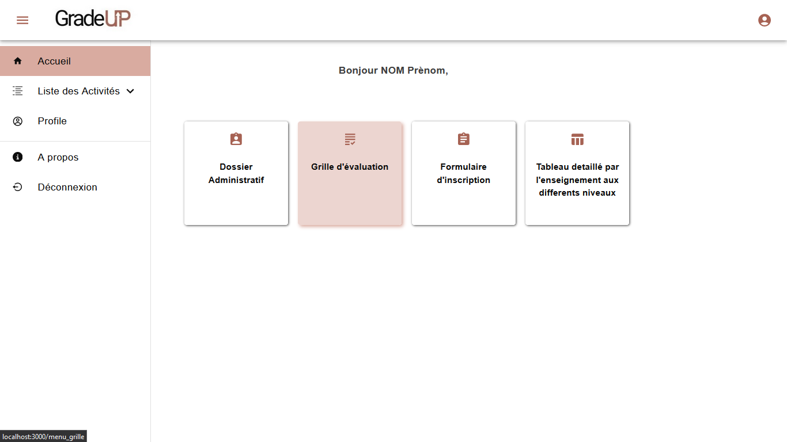
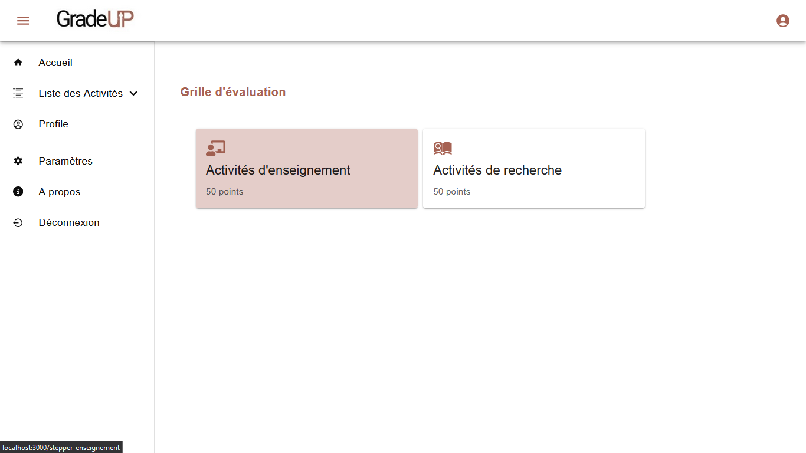
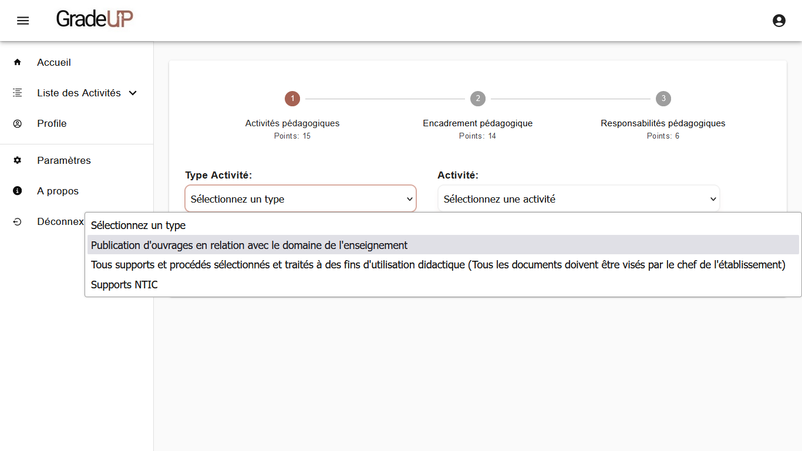
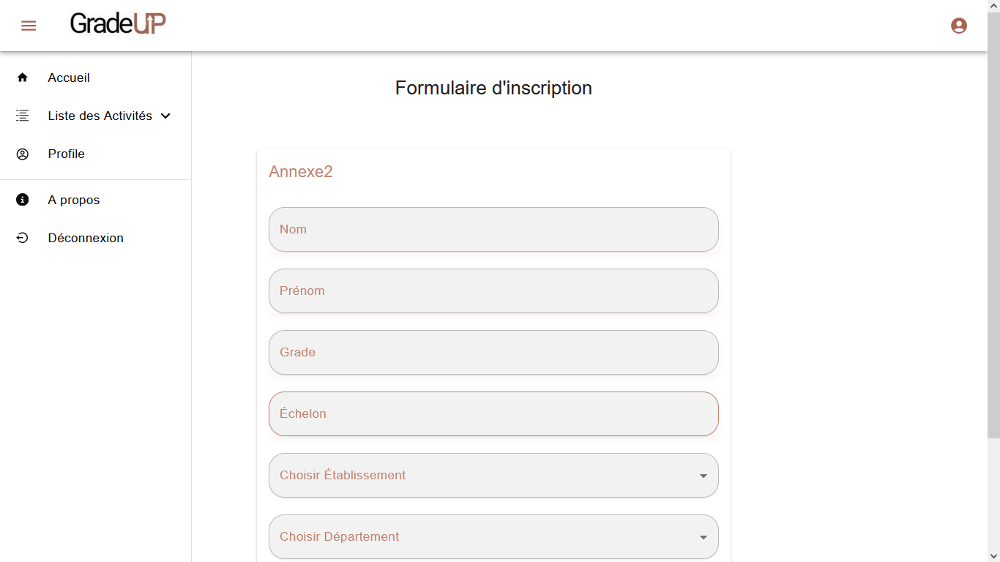
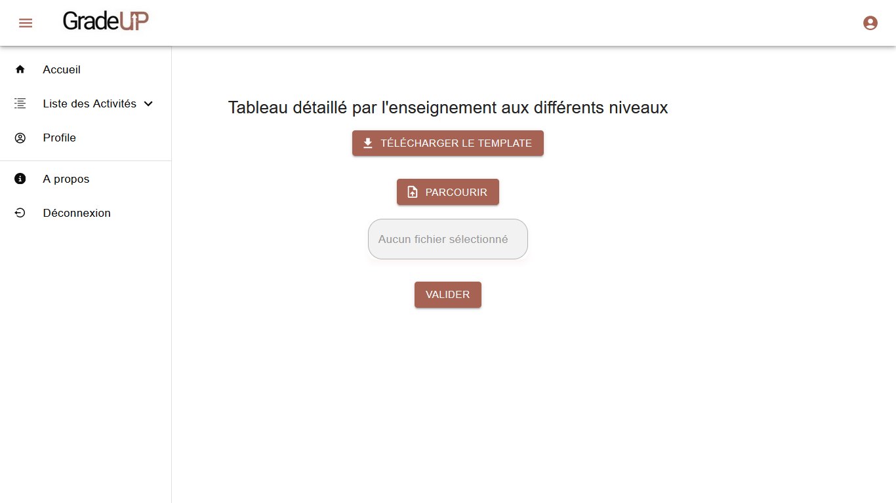
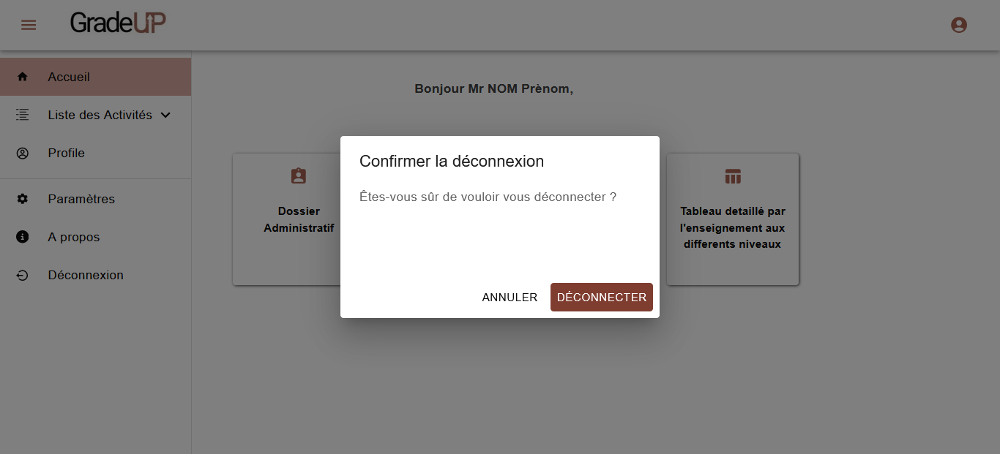
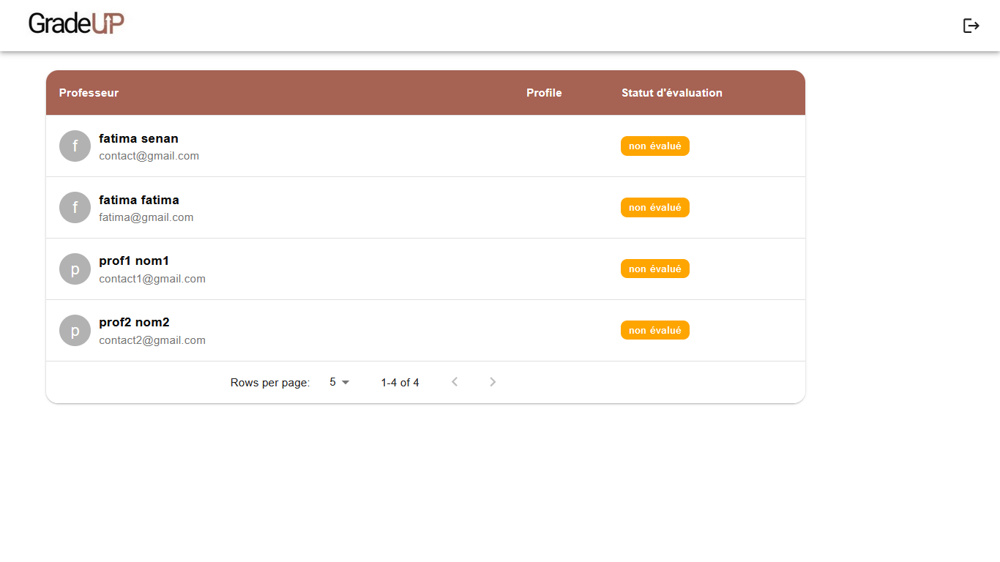
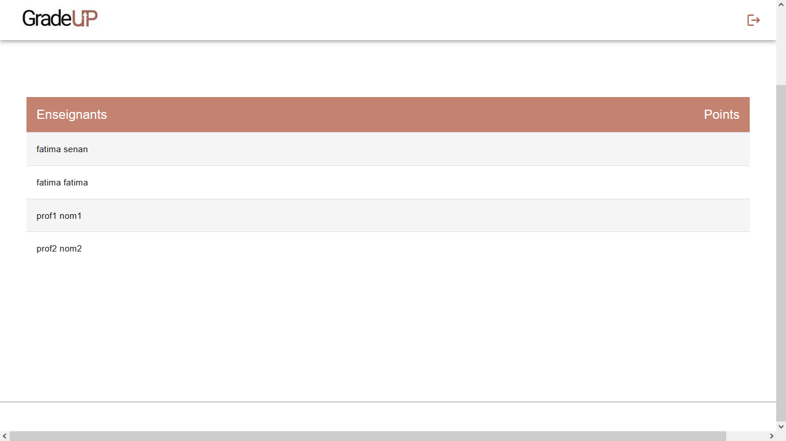

# GradeUP: Automatisation de la Promotion de Grade des Enseignants  

**GradeUP** est une application web innovante développée pour simplifier et automatiser le processus de promotion de grade des enseignants dans l'enseignement supérieur. Elle remplace les méthodes traditionnelles et manuelles par une solution numérique rapide, efficace et transparente.

---

## 🎯 **Objectifs**  
L'application vise à :  
- Automatiser le processus de promotion des grades.  
- Faciliter la gestion des dossiers administratifs et académiques.  
- Assurer une évaluation objective et transparente des enseignants.  
- Centraliser la gestion des candidatures et des évaluations.  

---

## ⚙️ **Technologies Utilisées**  
- **Frontend** : React.js  
- **Backend** : Java Spring Boot  
- **Base de données** : MySQL

---

## 📂 **Principales Fonctionnalités**

### **Pour les Professeurs**  
1. **Dossier Administratif** :  
   - Remplir un formulaire contenant des informations personnelles et professionnelles.  
   - Fournir des documents requis (certificats, relevés, etc.).  

2. **Formulaire d'Inscription** :  
   - Ajouter des informations spécifiques pour la candidature à la promotion.  

3. **Tableau Détaillé** :  
   - Télécharger un modèle Excel pour détailler les activités académiques.  
   - Soumettre ce fichier via l'application.  

4. **Grille d'Évaluation** :  
   - Sélectionner et décrire des activités académiques (publications, conférences, projets, etc.).  
   - Intégrer ces informations au dossier de candidature.  

### **Pour la Commission**  
- Vérification des informations et documents soumis.  
- Évaluation des activités académiques selon des critères prédéfinis.  
- Attribution de points pour chaque activité.  

### **Pour l’Administration**  
- Génération d'une liste triée des enseignants avec leurs scores d'évaluation.  
- Gestion efficace et transparente des promotions.  

---

## 📊 **Architecture du Projet**  
- **Architecture Modulaire** : séparation claire entre les rôles (professeurs, commission, administration).  
- **Interaction Frontend-Backend** : API REST pour une communication fluide.  
- **Design Responsive** : optimisé pour différents appareils.  

---

## 📸 ** Quelques Aperçus Visuels (Non Exhaustifs**  

### **9. Sign In**  


### **10. Sign Up**  
  


### **1. Accueil**  
  

### **7. Menu Grille**  
  

### **6. Grille**  
  


### **2. Activités**  
  


### **4. Annexe 2**  
  

### **5. Annexe 3**  
  


### **8. Logout**  
  

### **11. Commission**  
  

### **3. Administration**  
  
 

---

## 🚀 **Installation et Exécution**  

### **Prérequis**  
- Node.js et npm installés pour le frontend.  
- Java JDK pour exécuter le backend.  
- MySQL ou autre système de base de données configuré.  

### **Étapes**  
1. Clonez ce dépôt :  
   ```bash
   git clone https://github.com/votre-nom-utilisateur/GradeUP.git
   cd frontend
   npm install
3. Configurez le Backend
Ouvrez le dossier backend dans votre IDE préféré.
Configurez les paramètres de connexion à la base de données dans le fichier application.properties situé dans src/main/resources

4. Exécutez le Backend
    ```bash
    cd backend
   mvn spring-boot:run

6. Lancez le Frontend
    ```bash
   cd frontend
   npm start
